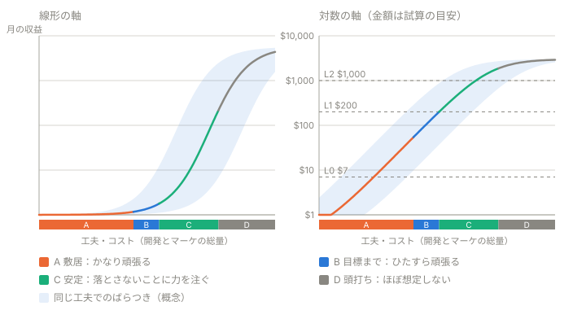

# magic-slide — 成功の定義と収益の試算

## なぜ書くか

前フェーズ（ミツモリ村）は、**成功の定義を置かずに始めた**。そのため結果を評価できず、「なんとなく失敗」という感覚だけが残った。試行そのものはPoCとして成功している（独自IPは簡単には作れない、ということが分かった）。今回は先に定義する。

入力値の出典と信頼度は[MARKET_DATA.md](MARKET_DATA.md)の5〜6章にある。ここでの数字はすべて**仮定を置いた概算**で、実績ではない。

## 成功の3段階（iOSで出す1本目を想定）

為替は仮に1ドル=150円とする。

| レベル | 月の収益 | 意味 |
|---|---|---|
| **L0：固定費の回収** | 約7ドル（約1,070円） | Apple Developer Programの年12,800円を月割りにした額。**1本目の必達目標**。「次の試合に安定して参入できる」状態 |
| **L1：成功** | 200ドル（約3万円） | 目指す水準。個人開発では達成できれば十分に良い部類 |
| **L2：大成功** | 1,000ドル（約15万円） | 達成できたら大成功。日本の個人開発の多くは月10万円未満とされるため、ここを常に狙うことはしない |

## 試算（広告収益のみ）

課金は入れず、広告だけで考える。1本目の設計を単純にするため。

```text
月の収益 = DAU × 1日の広告表示回数 × eCPM ÷ 1000 × 30
定常のDAU ≒ 1日の新規インストール数 × 1人あたりの平均プレイ日数（L）
```

### 入力値

| | 悲観 | 中央 | 楽観 | 根拠 |
|---|---|---|---|---|
| 1日の広告表示回数（DAUあたり） | 3回 | 6回 | 8回 | パズルの1プレイは短く、失敗のたびに広告を出せる。ただし出しすぎると継続率が落ちる |
| eCPM（表示1,000回あたりの収益） | 4ドル | 8ドル | 12ドル | リワードは日本で約15〜20ドル、インタースティシャルは米国で約14ドル。フィル率や仲介の目減りを見込んで割り引いた |
| **1日のARPDAU** | **0.012ドル** | **0.048ドル** | **0.096ドル** | 楽観はパズルの業界平均（0.08ドル、課金込み）と同じ水準 |
| 1人あたりの平均プレイ日数（L） | 2日（全ジャンルの中央値相当） | 3日 | 4日（パズルの良好な水準） | D1・D7・D30の曲線を台形で積分した概算 |

### 必要なDAUと新規インストール数

| | 悲観 | 中央 | 楽観 |
|---|---|---|---|
| **L0（約7ドル）に必要なDAU** | 約20 | 約5 | 約3 |
| **L1（200ドル）に必要なDAU** | 約560 | 約140 | 約70 |
| L1に必要な新規インストール数（1日） | 約280 | 約47 | 約17 |
| **L2（1,000ドル）に必要なDAU** | 約2,800 | 約700 | 約350 |

インストール数の行は、悲観がL=2、中央がL=3、楽観がL=4で計算している。

## 読み取れること

**L0は、規模の問題ではない。** 数DAUから20DAU程度で届く。論点は、審査を通して**出せるか**、出した後に**広告が実際に表示されるか**。なお、AdMobの支払い基準額は、日本円のアカウントで8,000円（米ドルは100ドル）で、確定額で判定される。L0水準の月約1,070円のペースでは、初回の入金まで約7〜8か月かかる。そのため、L0の達成は「収益が立つ」（L0-a）と「現金で回収する」（L0-b）に分けて考える（[L0_PLAN.md](L0_PLAN.md)）。

**L1は、無策では届かない。ただし届きうる帯にある。** 必要なDAUは70〜560人で、悲観と楽観で8倍の開きがある。必要な新規インストール数は17〜280人で、開きは16倍になる。この開きは、次の3つの掛け算で説明できる。

1. **eCPM（約3倍）**：日本語・日本のiOSに絞れば、単価の高い市場を狙える
2. **1DAUあたりの広告表示回数（約2.7倍）**：ゲームの設計で決まる
3. **継続（約2倍）**：1人が何日遊ぶか

1と2を掛けるとDAUの開き（8倍）になり、そこに3が加わると新規インストール数の開き（16倍）になる。

**最大の不確実性は「1日に何人が入ってくるか」。** 小規模タイトルの自然流入の分布データは、見つけられなかった。つまりL1の現実味は、この試算では決まらない。実際に出して測るしかない。

## 「尖らせる」方向（L1を狙う場合）

上の3つの掛け算に効く方向に尖らせる。ゲームの新奇性に尖らせても、L1への効き目は薄い。

| 方向 | 狙い | 中身 |
|---|---|---|
| **日本語・日本のiOSを優先する** | eCPMを上げる | 日本語で作り、日本のApp Storeで出す。海外展開は後回し |
| **広告ループを設計に組み込む** | 表示回数を増やす | 失敗する → リワード広告で続行 → すぐ再挑戦、が自然に回る作り。1プレイを1〜3分にする。強制広告は控えめにする |
| **見つけてもらう入口を作る** | 流入を増やす | ニッチなキーワードでのストア最適化、30秒の動画でルールが伝わること、自社HPやSNSからの導線 |
| 継続の仕組みを軽く入れる | 継続を伸ばす | デイリー目標など、軽いものにとどめる |

ルールの新奇性、ストーリー、IPの作り込みは、L1の段階では優先しない。

## 成長の形（概念）

横軸を「工夫・コスト（開発とマーケの総量）」、縦軸を「月の収益」としたときの形。**実測ではなく、上の試算の構造から導いた概念モデル。**



*金額は試算の目安で、実測ではない。破線のL0・L1・L2は、上の「成功の3段階」の水準。*

- **S字に近い。** 収益は「新規流入 × 継続日数 × 1日の収益」の掛け算なので、流入がゼロに近い間は、ゲームを磨いても収益は増えない。3つの要素がそろうと、要素ごとの工夫が積み重なって、対数で見ると直線に近い伸びになる。最後は、継続率・広告の許容量・市場の大きさに上限があり、頭打ちになる
- **指数的な伸びは、自動では続かない。** 続けるには、稼いだ分でユーザーを獲得する循環が要る。ただし、広告収益だけでは、1インストールが生涯で生む収益（約2セント〜38セント）が、パズルの平均CPI（約2〜3ドル）を大きく下回る。ユーザーを買って増やす循環は回らない。この循環を担うのが、パブリッシャー
- **同じ工夫量でも、結果は桁違いにばらつく。** 曲線は中央の見込みにすぎない。1本を重く作るより、軽い試行を複数回す方が期待値の面で有利になる

## 努力の配分方針（曲線のどこで何を頑張るか）

上の図のA〜Dに対応させる。

| 帯 | 曲線上の位置 | 方針 | 見るもの |
|---|---|---|---|
| **A 敷居** | 平らに見える帯から、指数的に伸びる帯の初期付近まで | **かなり頑張る。** 流入が立ち上がるまでは、ゲームを磨いても収益は増えない。マーケティング先行で、低コストの試行を重ねる。まずL0（固定費の回収）を確実に取る | 1日の新規インストール数、D1リテンション、L0への到達 |
| **B 目標まで** | 指数的に伸びる帯 | **経営上の事情で置いた目標に届くまで、ひたすら頑張る。** 目標は当面L1（月200ドル）を想定する。eCPM、1人あたりの広告表示回数、継続の3つを順に上げる。工夫がそのまま倍率になるので、最も効率が良い帯 | DAU、ARPDAU、D7リテンション |
| **C 安定** | 目標を達成した後。線形の軸で見ると、傾きの大きい直線に近い（対数の軸では指数的） | **安定させることに力を注ぐ。** 伸ばすことより、落とさないこと。広告単価の変動、ストアの規約変更、流入の減少に備え、運用を型にして手間を減らす | 月ごとの収益の振れ幅、DAUの推移 |
| **D 頭打ち** | S字の上側 | **ほぼ到達しないものとして扱う。** 届くには、サポート体制（資金、人、パブリッシャーなどの支え）の質が大きく変わる必要がある | — |

### 再定義のトリガー

**Dが見えてきたら、つまりサポート体制の質が大きく変わる見込みが出てきたら、プロジェクトの定義と意義そのものを再整理する。** それまでは、A→B→Cの順に、今の体制のまま進める。

「見えてきた」と判断する具体的な目安は、まだ決めていない。

## DAUとは

- **Daily Active Users。その日に1回以上遊んだ人の数（重複なし）。** 1人が10回開いても1と数える
- **累計インストールとの違い：** インストールは「流れ」（1日に何人増えたか）、DAUは「その日の在庫」（今日何人が遊んでいるか）
- **つながり：** `定常のDAU ≒ 1日の新規インストール数 × 1人が遊ぶ平均日数`
- **広告収益との関係：** 広告収益 = DAU × 1人あたりの広告表示回数 × 単価
- 「アクティブ」の定義（起動しただけか、実際に遊んだか）は、測り方で変わる

## パブリッシャー路線（達成シナリオの1つ）

- **位置づけ：これは達成シナリオの1つ。** 普通は、自分で出して自分で進めていく（独自路線）のが基本になる。そのうえで、初期作をパブリッシャーに見せるポートフォリオとして使い、収益を分け合う参入をする道もある、という位置づけ。自社HPに置くものではない
- **パブリッシャーが見るのは計測値。** ハイパーカジュアルではD1リテンション45%超・CPI 0.25ドル未満が目安（Voodoo）。ただしパズルやハイブリッドでは基準が異なる可能性がある。パズルのD1は平均で約32%なので、この基準は高い。多くの試作は落ちる前提になる
- **だからポートフォリオで示すのは「当たる」ことではなく、「試作して、計測して、直す」速度と実績。** ビルド、動画、計測結果をそろえる
- **前提として、第三者の素材やコードを含まないこと。** vendorのアセットと`bundle.js`を使ったものは、パブリッシャーには出せない。権利上の置換と、自前のエンジンが必須になる

## 2つの機能を分ける

**現時点の作業は、どちらかといえばパブリッシャー的な観点からの分析にあたる。** 市場データの調査、成功の定義、収益の試算は、いずれもパブリッシャーが見る観点の作業。ゲーム作りの側（コアのルール、手触り、継続の仕組み）の設計は、これからになる。

| | ゲーム作り | パブリッシャー機能 |
|---|---|---|
| 担当する内容 | コアのルール、手触り、継続の仕組み、広告を出す位置の設計 | ユーザー獲得、広告SDKと仲介、ストアの運営、運用 |
| 当面の担当 | 自分 | 自分が最小限で担当する（AdMob、ストア最適化）。将来は外部のパブリッシャーに渡せる形にしておく |

**実装でも境界を分ける。** 今の構成が、すでにその形になっている。ゲーム側は`start / end / save / getdata / ad / rewardad`というメッセージでホストに依頼し、ホスト側（`GameCenter.tsx`）が応える。iOS版でも、ゲームの中に広告SDKを直接埋め込まず、「広告を出してほしい」という要求の窓口だけを持つ形を保つ。これなら、パブリッシャーに渡すときに、広告まわりだけを差し替えられる。

## テーマの方針

**中立を目指さない。軽いテーマを持たせる。** 中立に固執すると、かえって手間が増えることがある。また、テーマを持たせる試行自体が、次に活きる。

- **決めること：** 世界観の一言、タイルのモチーフ5種類、配色、音の雰囲気、名前。**1ページのテーマシートにとどめる。** IPバイブルは作らない（ミツモリ村では、入口で作り込みすぎた）
- **採用の基準：**
  1. 次作でも流用できる
  2. 素材を一貫して作れる（AI生成を含む）。必要な種類が少ない
  3. 特定の既存IPに依存しない
  4. 対象層（35歳以上の女性、日本）に合う
- **候補の例（決定ではない）：** 和菓子、園芸、純喫茶、動物。日本の35歳以上の女性向けで、Candy Crushの洋菓子・宝石系とは違う方向として挙げた。決める前に、素材を一貫して生成できるかを確かめる

## 未確定の事項

- 小規模タイトルの自然流入の分布（試算の最大の不確実性）
- Appleの審査での「複製」の扱い。素材を替えても、ルールが近いだけで指摘される可能性があるかは要確認
- 日本のiOSでの実効eCPM
